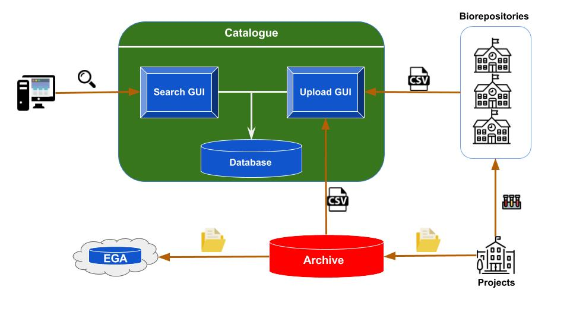
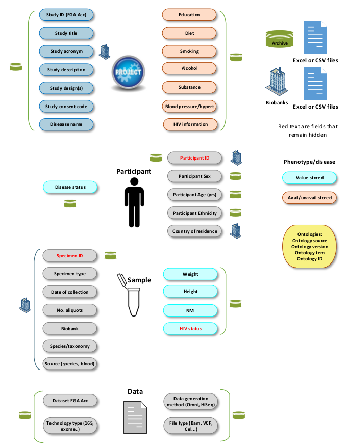

# Introduction

Visit [H3Africa.org](https://h3africa.org/) for more details.

## H3Africa Biospcimens and Data Catalogue

[The H3Africa Catalogue](https://h3acatalog.sanbi.ac.za/) project aims to offer researchers from worldwide the ability to filter
information of published African bioinformatics studies. The stackholders of the African projects were able to
tuck the biospecimens and data associated for their own subsequent studies. Instead, they decided to share them with
the scientific community for the objective of furthering research and benefiting individuals from the outcome results
of all studies using the biospecimens and data associated. Therefore, the biospecimens are transferred from the institutions
and universities to central places; biobanks. Three H3Africa biobanks are created across the African continent, two in the
central part, Ghana and Nigeria, and one in the southern part, South Africa, to contain the projects biospcimens

* [IBRH3AU](http://www.ibru.mak.ac.ug/)
* [CLS](http://www.cls.co.za/)
* [IHVN](http://www.ihvnigeria.org/)

In addition, a laboratory information management systems (LIMS) are acquired for each bioabnk and used to store biospecimens
metadata and track all changes that can happen to them. For example, as a routinely operation, an aliquot of
each biospecimen received by the bioabanks is used to extract DNA and stored for eventual research demand. Thus, the
volume change is automatically updated in the LIMS.

The H3Africa archive is a separate project and aims to provide computing hardware memory capacities to receive the datasets
linked to, phenotype information, or generated from, DNA sequences in fasta format in case of genomic studies, biospecimens
stored in the biorepositories. Usually, datasets generated from bioinformatics studies are of order of Gigabytes if not
Terabytes. Thereby, the archive people decided to keep the datasets for a maximum period of time of 9 months then migrate
them to the EGA servers. One can wonder why not primarily send the datasets to EGA? The reason why, the access to the archive
datasets, before their migration to EGA and put them available to the general public, is granted only to the African
researchers. This is so, to encourage and boost research in the African continent.

## High view architecture of the catalogue

**Figure 1:** *High view architecture  of the catalogue. At the bottom right the institutions running the studies; collecting
the specimens, processing them and generating results of different formats, e.g. files, as part of the global study.
The leftover study's biospecimens with there metadata are sent to one of the biorepositories. The biorepository
updates the content of their LIMS with the new arrived information. The datasets generated from the studies are sent
to be kept in the Archive for a period of 9 months. After the end of this period, the files are transferred to EGA.
Both, archive and biorepositories, export csv files carrying out metadata of their content and upload them into the
catalogue, triggring the update of the catalogue database. Therefore, the end users are updated with the latest
information in the catalogue*

The catalogue is a Java application written in Spring boot framework. Three modules compose the catalogue: an upload
module, a database and a search engine (Figure 1).

The upload module expects a well formatted csv file structured following a predefined templates. There is one template
conceived for the repositories and two others for the archive. The archive split the information into projects and
participants metadata. Although the template restricts the nomenclature of the captured field naming it circumvent
one of the most challenging data sharing, data harmonization. Therefore, reducing the complexity of searching data
stemming from different sources. Furthermore, opting for export and upload csv files as an option for feeding the
catalogue database is not necessarily the best option. Normally, Application Programming Interfaces (APIs) are most
suited for a such a work. However, none of the application running in the biorepositories nether in the archive have
implemented a such solution.

The metadata are stored in a Neo4j graph, schemaless and NoSQL database. In a graph database, nodes represent the
entities that may be extracted from the metadata, e.g Study, Participant, Biospecimen, etc. and the vertices are the
logic relating the nodes to each other, e.g a Biospecimen node is in relationship with a Participant node.

The search engine module comes with an easy web interface exposing many HTML fields to use for filtering the content of
the database. Although it is possible to query with participant and biospecimen fields the returned result is always a
list of studies with a general summary information about their participants and biospecimens. For ethical reasons,
sensitive information revealing the identity of the study individuals are kept unrevealed to researchers. Only
authorized users have the ability to know certain information about the participants and the biospecimens as described
in the "Data and Biospecimens requesting".

## Catalogue data capturing

**Figure 2:** 
*All the CSV columns captured in the catalogue database. The columns are categorised into 4 principal entities: Project,
Participant, Biospecimen and Dataset. In addition, their provenance, from Biorepositories or Archive, is shown.
Sensitive information are shown in red meaning that they are hidden and are not shown to the end users.*

To avoid appellation discrepencies of the information received from the biorepositories, the different players of the
H3Africa Catalogue project with members from each biorepository defined a standard CSV template to use as a model for
their export of the information from the LIMS and are relevant for the catalogue (Figure 2).

!!! Note
    Although there is one Archive unit, standard CSV templates are defined as what the catalogue side await as information
    from the archive.
    
Biospecimen data comes from the biorepositories, in the other hand Study, Participant and Dataset information originate
from the archive. However, common fields exist in both sides, biorepository and archive, and play a key role in linking
both information, e.g Study acronym link a biospecimen in a biobank to a study in the archive, idem for Participant ID
which link a biospecimen to a participant. As a reminder, all the information whether in the biorepositories or in the
archive are engendered from the same origin; the project holders whose initiated the studies, why the common fields are
in both sides.
